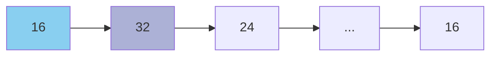
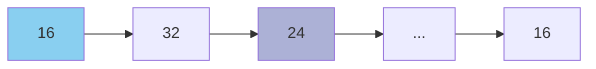
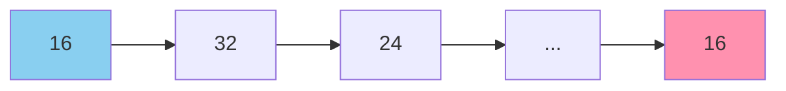

+++
title = 'avl tree를 이용한 중복값 검사'
date = 2024-01-02T23:04:21Z
tags = ["data structure", "algorithm"]
+++

---
## avl tree를 사용한 중복 검사
---

### 개요
본문은 보다 효율적으로 중복 여부를 검사하기 위해 고민한 경험을 공유하기 위해 작성되었다.  
이 주제를 고민하게 된 계기는 [42 서울](https://42seoul.kr/seoul42/main/view)의 2서클 과제인 push_swap이었다.  
당장 push_swap의 모든 것을 알 필요는 없다. 그 내용이 방대할 뿐더러, 이 글의 내용을 이해하는 데 필요하지도 않기 때문이다.  
중요한 것은 push_swap을 구현하기 위해 데이터들의 중복 여부를 검사하는 알고리즘을 만들어야 한다는 사실이다.  
보다 자세한 조건은 아래와 같다.

1. 데이터는 main 함수의 매개변수로 받는다.
2. 모든 데이터는 int형이다 (main의 매개변수로 받으면 char **형태로 들어오지만, atoi를 이용해 변환한다).
3. 모든 데이터는 서로 중복되지 않아야 한다.

가장 간단하게 떠올릴 수 있는 방법은 모든 데이터를 서로 비교하는 것이다.  
  

  

  

  
그러나 이와 같은 방법은 O(n^2)의 시간 복잡도를 갖기 때문에 최적화에 불리하다.  
내 주변의 동료들은 최적화를 포기하고 위의 방법을 사용하거나, 퀵 정렬을 이용해 데이터를 정렬한 후 i의 값을 1씩 늘리며 i, i + 1번째 원소를 서로 비교하는 방법을 사용하였다.  
필자는 처음에는 이진탐색트리를 구현하였다.  
  
```
int main(int argc, char ** argv)
{
	double start;       //검색 시작 시간
	double end;         //검색 종료 시간
	int func_returned;

	int		*storage;
	t_node	*storage2;

	int	i, j;

	if (argc <= 1)
		return (0);

    /*
    방법 1. 모든 데이터를 서로 비교
    */
	
	start = clock();

	storage = (int *)calloc(argc - 1, sizeof(int));

	i = 0;
	while (i < argc - 1)    //main으로 받은 문자열들을 int로 변환해 storage에 저장
	{
		storage[i] = atoi(argv[i + 1]);
		i++;
	}
	
	i = 0;
	while (i < argc - 2)    //데이터를 자기보다 뒤쪽에 위치한 모든 값들과 비교.
	{
		j = i + 1;
		while (j < argc - 1)
		{
			if (storage[i] == storage[j])
			{
				printf("found dup : %d\n", atoi(argv[j + 1]));  //중복값이 있으면 그 값을 출력하고 반복문을 종료
				i = argc;
			}
			j++;
		}
		i++;
	}
	free(storage);
	end = clock();
	printf("method 1 runtime : %f\n", (end - start) / CLOCKS_PER_SEC);  //검색에 걸린 시간 출력

    /*
    방법 2. 이진탐색트리
    */

	start = clock();

	storage2 = 0;
	i = 0;
	while (i < argc - 1)
	{
		func_returned = search_tree(&storage2, atoi(argv[i + 1]));  //데이터를 트리에 이어붙임
		if (func_returned == -1)                                    //malloc protection
		{
			free_tree(storage2);
			return (0);
		}
		else if (func_returned == 1)                                //트리에 중복값이 있었으면 그 값을 반환
		{
			printf("found dup : %d\n", atoi(argv[i + 1]));
			break;
		}
		i++;
	}
	free_tree(storage2);
	end = clock();
	printf("method 2 runtime : %f\n", (double)(end - start) / CLOCKS_PER_SEC);  //검색애 걸린 시간 출력
}
```

---

