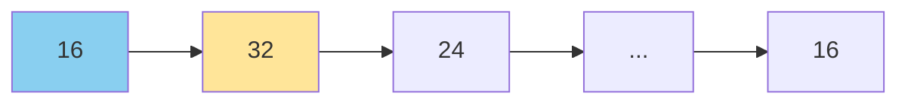
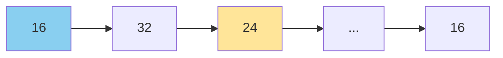
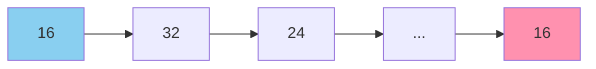
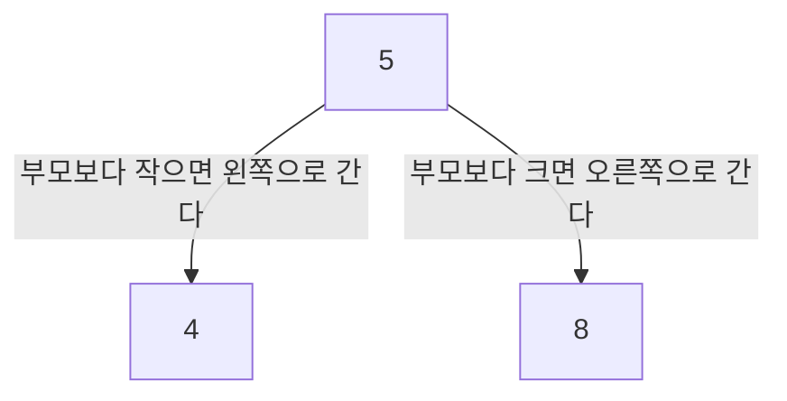
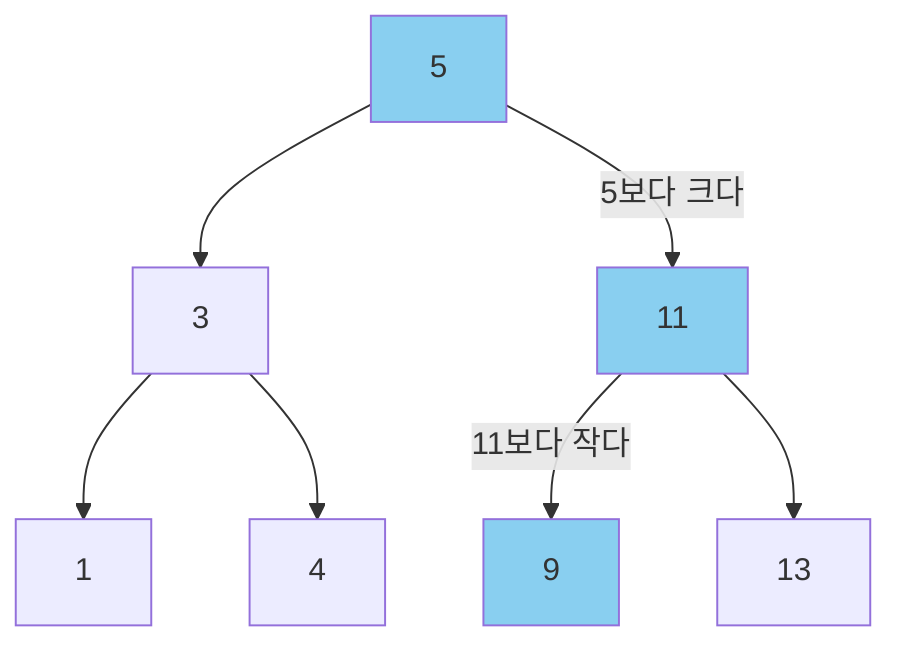
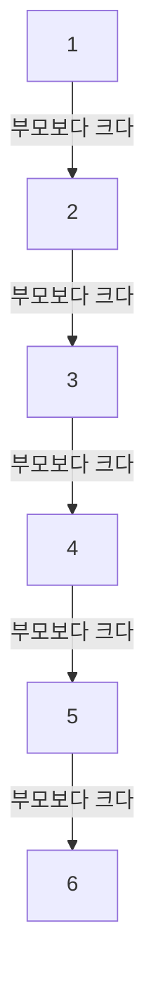
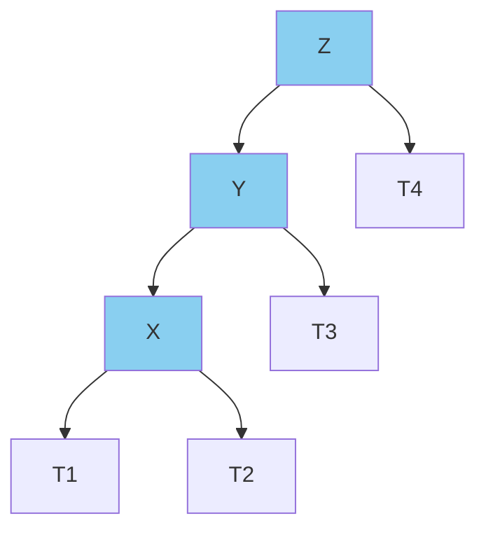
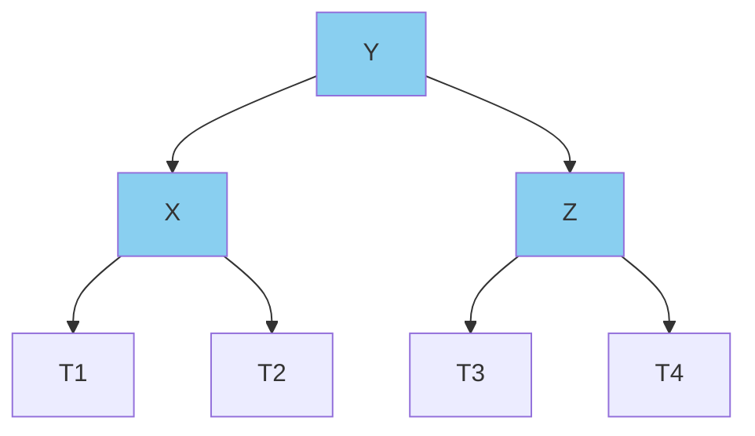
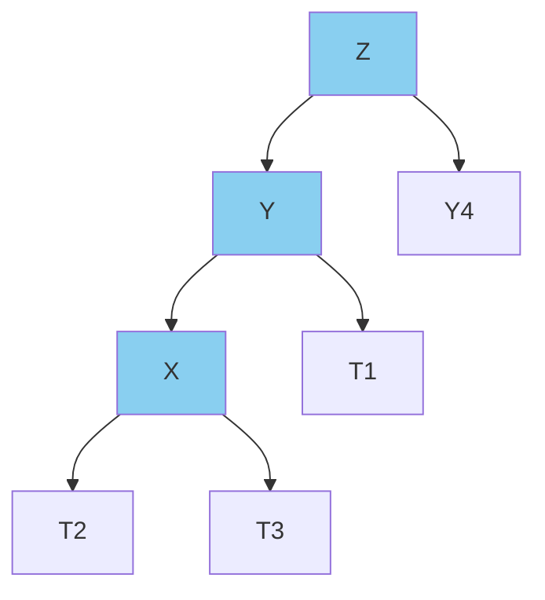
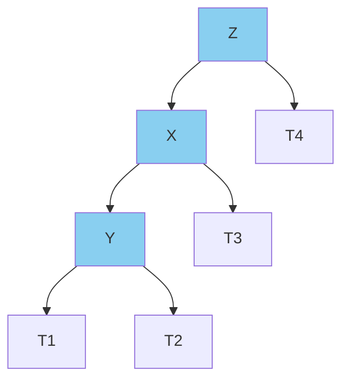

+++
title = 'avl tree를 이용한 중복값 검사'
date = 2024-01-02T23:04:21Z
tags = ["data structure", "algorithm"]
+++

---
## avl 트리를 사용한 중복 검사
---

### 개요
본문은 보다 효율적으로 중복 여부를 검사하기 위해 고민한 경험을 공유하기 위해 작성되었다.  
이 주제를 고민하게 된 계기는 [42 서울](https://42seoul.kr/seoul42/main/view)의 2서클 과제인 push_swap이었다.  
당장 push_swap의 모든 것을 알 필요는 없다. 그 내용이 방대할 뿐더러, 이 글의 내용을 이해하는 데 필요하지도 않기 때문이다.  
중요한 것은 push_swap을 구현하기 위해 데이터들의 중복 여부를 검사하는 알고리즘을 만들어야 한다는 사실이다.  
보다 자세한 조건은 아래와 같다.

1. 데이터는 main 함수의 매개변수로 받는다.
2. 모든 데이터는 int형이다 (main의 매개변수로 받으면 char **형태로 들어오지만, atoi를 이용해 변환한다).
3. 모든 데이터는 서로 중복되지 않아야 한다.
  
---
  
### 문제해결 - 이진 탐색 트리
가장 간단하게 떠올릴 수 있는 방법은 모든 데이터를 서로 비교하는 것이다.  
  

  

  

  
그러나 이와 같은 방법은 O(n^2)의 시간 복잡도를 갖기 때문에 최적화에 불리하다.  
내 주변의 동료들은 최적화를 포기하고 위의 방법을 사용하거나, 퀵 정렬을 이용해 데이터를 정렬한 후 i의 값을 1씩 늘리며 i, i + 1번째 원소를 서로 비교하는 방법을 사용하였다.  
필자는 처음에는 이진탐색트리를 구현하였다. 
이진탐색트리는 자식이 2개인 tree로 아래와 같은 구조를 가진다.   
  

  
평균적으로, 이진탐색트리는 모든 데이터와 값을 대조할 필요가 없으므로 효율적인 알고리즘이다 (검색을 데이터의 수만큼 실행하므로 O(n * logn)).  
  
(9를 검색하는 경우)

  
이를 코드로 구현한 내용은 아래와 같다.  
  
```
typedef struct s_node   //트리 구성 노드
{
	int data;
	struct s_node *right;
	struct s_node *left;
}	t_node;

void free_tree(t_node *tree)	//트리의 위에서 아래로 내려가면서 재귀적으로 할당을 해제
{
	if (tree -> right)
		free_tree(tree -> right);
	if (tree -> left)
		free_tree(tree -> left);
	if (tree)
		free(tree);
}

int search_tree(t_node **tree, int s)
{
	if (*tree == 0) //포인터가 null을 가리키고 있다면 받아온 데이터로 새로운 노드를 생성한다.
	{
		*tree = (t_node *)calloc(1, sizeof(t_node));
		if (*tree == 0)
			return (-1);
		(*tree) -> data = s;
		return (0);
	}
	else
	{
		if ((*tree) -> data < s)    //현재 노드보다 값이 작다면 왼쪽으로 보낸다.
			return (search_tree(&((*tree)->right), s));
		else if ((*tree) -> data == s)  //현재 노드와 값이 같다면(중복이 존재한다면) 1을 반환하고 재귀를 종료한다.
			return (1);
		else
			return (search_tree(&((*tree)->left), s));  //현재 노드보다 값이 크다면 오른쪽으로 보낸다.
	}
}

int main(int argc, char ** argv)
{
	double start;       //검색 시작 시간
	double end;         //검색 종료 시간
	int func_returned;

	int		*storage;
	t_node	*storage2;

	int	i, j;

	if (argc <= 1)
		return (0);

    /*
    방법 1. 모든 데이터를 서로 비교
    */
	
	start = clock();

	storage = (int *)calloc(argc - 1, sizeof(int));

	i = 0;
	while (i < argc - 1)    //main으로 받은 문자열들을 int로 변환해 storage에 저장
	{
		storage[i] = atoi(argv[i + 1]);
		i++;
	}
	
	i = 0;
	while (i < argc - 2)    //데이터를 자기보다 뒤쪽에 위치한 모든 값들과 비교.
	{
		j = i + 1;
		while (j < argc - 1)
		{
			if (storage[i] == storage[j])
			{
				printf("found dup : %d\n", atoi(argv[j + 1]));  //중복값이 있으면 그 값을 출력하고 반복문을 종료
				i = argc;
			}
			j++;
		}
		i++;
	}
	free(storage);
	end = clock();
	printf("method 1 runtime : %f\n", (end - start) / CLOCKS_PER_SEC);  //검색에 걸린 시간 출력

    /*
    방법 2. 이진탐색트리
    */

	start = clock();

	storage2 = 0;
	i = 0;
	while (i < argc - 1)
	{
		func_returned = search_tree(&storage2, atoi(argv[i + 1]));  //데이터를 트리에 이어붙임
		if (func_returned == -1)                                    //malloc protection
		{
			free_tree(storage2);
			return (0);
		}
		else if (func_returned == 1)                                //트리에 중복값이 있었으면 그 값을 반환
		{
			printf("found dup : %d\n", atoi(argv[i + 1]));
			break;
		}
		i++;
	}
	free_tree(storage2);
	end = clock();
	printf("method 2 runtime : %f\n", (double)(end - start) / CLOCKS_PER_SEC);  //검색애 걸린 시간 출력
}
```

(출력 결과)  
```
//길이 500짜리 난수 배열을 입력했을 때
found dup : 2378
method 1 runtime : 0.000262
found dup : 2378
method 2 runtime : 0.000115

//길이 1000짜리 난수 배열을 입력했을 때
found dup : 7687
method 1 runtime : 0.000937
found dup : 7687
method 2 runtime : 0.000236
```  
  
평균적으로 방법 2가 더 빠른 것을 볼 수 있다.  
  
---

### 문제해결 - avl 트리
그러나 이진 탐색 트리는 한 가지 단점을 갖는다.  
정렬된 배열이 입력으로 들어왔을 때 트리가 아래와 같은 모양으로 생성된다는 점이다.  
  

  
결과적으로 방법 1과 다를 바 없는 시간복잡도를 가지며, malloc과 free가 포함되기 때문에 오히려 느려진다.

(출력결과)
```
\\길이 500짜리 정렬된 배열을 입력했을 때
found dup : 500
method 1 runtime : 0.000257
found dup : 500
method 2 runtime : 0.000650
```  
  
이를 해결하기 위해 사용하는 방법이 avl 트리이다. avl 트리란 왼쪽과 오른쪽의 깊이가 2 이상 차이날 때 아래와 같이 자동으로 균형을 회복하는 기능을 가진 트리이다.  
  
(왼쪽으로 트리가 기울어진 경우. T1 ~ T4 포인터는 null을 가리키고 있어도 무방하다)
(LL 케이스)  

아래와 같이 변환한다.  

  
  
(LR 케이스의 경우 LL 케이스로 변환 후 처리한다.)  
  

아래와 같이 변환한다.  

  
오른쪽으로 치우친 경우 위의 경우를 대칭으로 적용한다.  
이를 코드로 구현하면 아래와 같다.  
  
```
void	left_case(t_node **tree)	//노드의 연결을 수정하여 트리의 균형을 맞춘다.
{
	t_node	*tmp1;
	t_node	*tmp2;

	if ((*tree)->left != 0)	//LR인 경우 LL로 전환
	{
		if ((*tree)->left->right != 0)
		{
			if ((*tree)->left->left == 0)
			{
				tmp1 = (*tree)->left;
				tmp2 = (*tree)->left->right;
				(*tree)->left = tmp2;
				tmp2 = (*tree)->left->left;
				(*tree)->left->left = tmp1;
				(*tree)->left->left->right = tmp2;
			}
		}
	}
	/*
	LL 케이스 처리
	*/
	tmp1 = *tree;
	tmp2 = (*tree)->left;
	*tree = tmp2;
	tmp2 = (*tree)->right;
	(*tree)->right = tmp1;
	if ((*tree)->right != 0)
		(*tree)->right->left = tmp2;
}

void	right_case(t_node **tree)
{
	t_node	*tmp1;
	t_node	*tmp2;

	if ((*tree)->right != 0)	//RL인 경우 RR로 전환
	{
		if ((*tree)->right->left != 0)
		{
			if ((*tree)->right->right == 0)
			{
				tmp1 = (*tree)->right;
				tmp2 = (*tree)->right->left;
				(*tree)->right = tmp2;
				tmp2 = (*tree)->right->right;
				(*tree)->right->right = tmp1;
				(*tree)->right->right->left = tmp2;
			}
		}
	}
	/*
	RR 케이스 처리
	*/
	tmp1 = *tree;
	tmp2 = (*tree)->right;
	*tree = tmp2;
	tmp2 = (*tree)->left;
	(*tree)->left = tmp1;
	if ((*tree)->left != 0)
		(*tree)->left->right = tmp2;
}

int	balance_tree(t_node **tree, int depht)	//트리의 균형을 맞추는 함수
{
	int	balance_parameter;
	int	depht_l;	//왼쪽 트리의 깊이
	int	depht_r;	//오른쪽 트리의 깊이

	if (*tree == 0)
		return (depht);
	/*
	자식 노드 -> 부모 노드 순으로 함수가 실행된다 = 트리의 아랫부분 부터 균형을 맞추며 위로 올라간다. 
	자식 노드로 재귀할 때 깊이를 1 더한다.
	*/
	depht_l = balance_tree(&((*tree)->left), depht + 1);
	depht_r = balance_tree(&((*tree)->right), depht + 1);
	balance_parameter = depht_r - depht_l;	//balance_parameter의 절대값이 2 이상이면 균형을 맞춘다.
	if (balance_parameter < -1)	//왼쪽으로 치우친 경우
	{
		left_case(tree);
		return (depht_l - 1);	//깊이를 반환
	}
	else if (balance_parameter > 1)	//오른쪽으로 치우친 경우
	{
		right_case(tree);
		return (depht_r - 1);	//깊이를 반환
	}
	if (depht_l > depht_r)	//트리의 깊이가 2 이상 차이나지 않을 경우, 깊이가 더 깊은 쪽을 반환
		return (depht_l);
	else
		return (depht_r);
}
```  
  
```
int main(int argc, char **argv)
{
	(중략)
	start = clock();

	storage2 = 0;
	i = 0;
	while (i < argc - 1)
	{
		func_returned = search_tree(&storage2, atoi(argv[i + 1]));
		if (func_returned == -1)
		{
			free_tree(storage2);
			return (0);
		}
		else if (func_returned == 1)
		{
			printf("found dup : %d\n", atoi(argv[i + 1]));
			break;
		}
		if (i % 50 == 0)	//50번에 한번씩 트리를 정렬
			balance_tree(&storage2, 0);
		i++;
	}
	free_tree(storage2);
	end = clock();
	printf("method 2 runtime : %f\n", (double)(end - start) / CLOCKS_PER_SEC);
}
```  
(출력결과)  
```
//길이 100짜리 정렬된 배열을 입력했을 때
found dup : 100
method 1 runtime : 0.000039
found dup : 100
method 2 runtime : 0.000042
//길이 500짜리 정렬된 배열을 입력했을 때
found dup : 500
method 1 runtime : 0.000285
found dup : 500
method 2 runtime : 0.000254
//길이 1000짜리 정렬된 배열을 입력했을 때
found dup : 1000
method 1 runtime : 0.000936
found dup : 1000
method 2 runtime : 0.000386
//길이 100짜리 난수 배열을 입력했을 때
found dup : 6202
method 1 runtime : 0.000038
found dup : 6202
method 2 runtime : 0.000039
//길이 500짜리 난수 배열을 입력했을 때
found dup : 8144
method 1 runtime : 0.000252
found dup : 8144
method 2 runtime : 0.000195
//길이 1000짜리 난수 배열을 입력했을 때
found dup : 8469
method 1 runtime : 0.000941
found dup : 8469
method 2 runtime : 0.000362
```  
  
balance_tree 함수가 실행시간을 많이 잡아먹기 때문에 50번에 한 번씩만 정렬하는 식으로 타협하여 구현하였다.  
입력이 정렬된 상태로 들어올 때, 섞여서 들어올 때 모두 방법 1보다 비슷하거나 우월한 결과를 보인다.  
