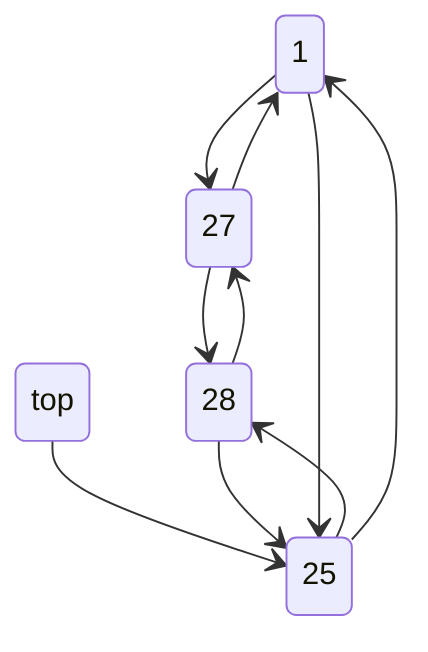
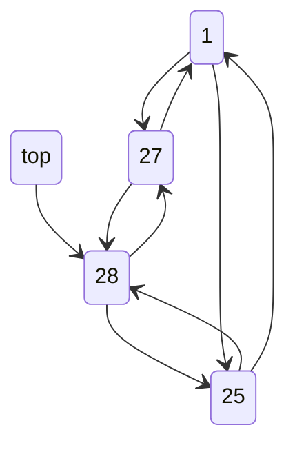
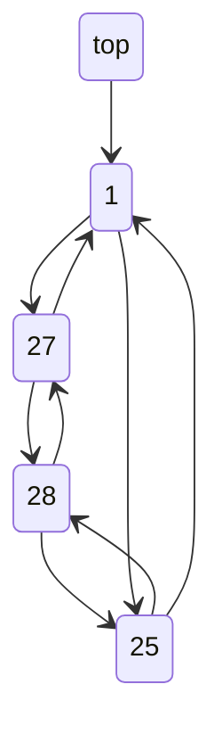

+++
title = '원형 이중 연결 리스트를 이용한 마법의 스택 구현'
date = 2024-01-09T08:27:14Z
tags = ["C_language", "data structure", "42seoul", "push_swap"]
+++

---
## 원형 이중 연결 리스트를 이용한 마법의 스택 구현
---

### 개요
[#push_swap](https://budnarae.github.io/tags/push_swap/)의 다른 글들과 이어진다.  
입력받은 데이터가 [중복 검사]()를 무사히 통과하였다면, 2개의 스택을 구현한 후 ***그 스택들'만'을*** 이용하여 데이터를 정렬해야 한다.  
단, 통상의 스택과 달리 아래의 연산이 추가적으로 가능해야 한다(stack a, b 단 둘만 존재한다고 가정한다).  
  
 - pa : stack b의 top을 stack a의 top으로 옮김
 - pb : stack a의 top을 stack b의 top으로 옮김
 - sa : stack a의 제일 꼭대기의 값 2개를 서로 뒤바꿈
 - sb : stack b의 제일 꼭대기의 값 2갤르 서로 뒤바꿈
 - ss : sa 와 sb를 동시에 실행
 - ra : stack a의 모든 원소를 한 칸 위로 올린다. top은 맨 아래로 옮긴다.
 - rb : stack b의 모든 원소를 한 칸 위로 올린다. top은 맨 아래로 내린다.
 - rr : ra와 rb를 동시에 실행한다.
 - rra : stack a의 모든 원소를 한 칸 아래로 내린다. bot(스택의 제일 아래)은 맨 위로 옮긴다.
 - rrb : stack b의 모든 원소를 한 칸 아래로 내린다. bot(스택의 제일 아래)은 맨 위로 옮긴다.
 - rrr : rra와 rrb를 동시에 실행한다.
   
---
  
### 문제해결 - 원형 이중 연결 리스트
따라서 앞으로 이 스택을 마법의 스택이라 명명하기로 한다. 이 호칭은 42 서울의 또 다른 10기 교육생 hyunjunl 님의 아이디어이다.  
필자는 마법의 스택을 구현하기 위해 원형 이중 연결 리스트를 사용하기로 하였다.  
이 자료구조는 ra, rb, rra, rrb를 매우 간단하게 구현할 수 있다는 장점이 있다. 단순히 head를 앞이나 뒤로 한 칸씩만 옮기면 되기 때문이다.   

  

  

  
그러나 pa, pb, 그리고 sa, sb의 경우 다수의 노드 간 연결을 수정해야 하므로 구현이 복잡해진다.  
그럼에도 추후에 필자가 사용할 정렬 알고리즘은 ra, rb, rra, rrb 연산을 매우 많이 사용하기 때문에 이점이 있다고 판단하였다.  

---
  
이 포스트에서 다룬 내용의 코드 구현이 보고싶다면 필자의 [42 seoul git](https://github.com/Budnarae/42_seoul/tree/main)의 push_swap에서 most_basic_2.c, most_basic.c, operations.c, 그리고 push_swap.h 헤더파일의 t_stack 구조체를 참조하기를 바란다.