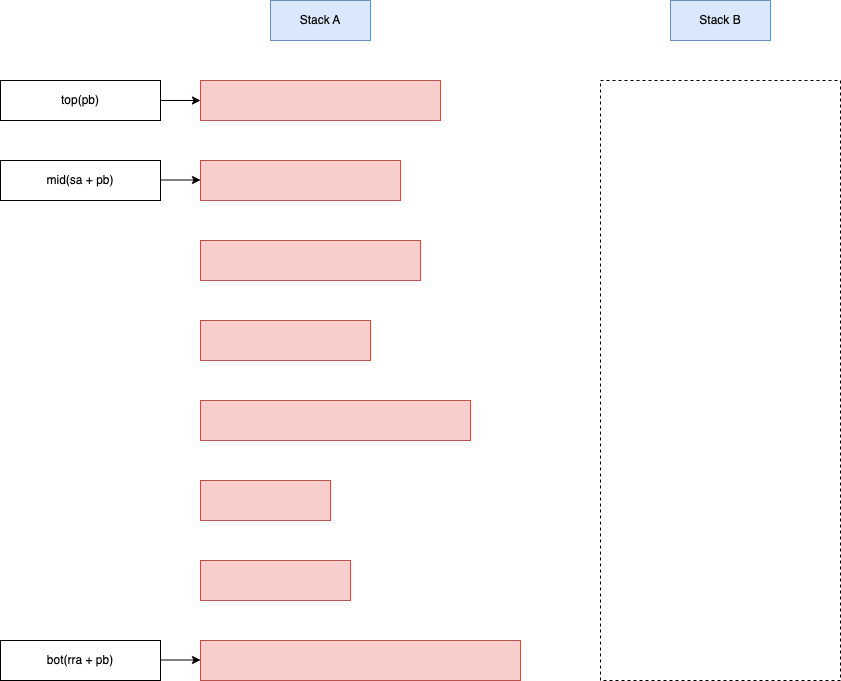
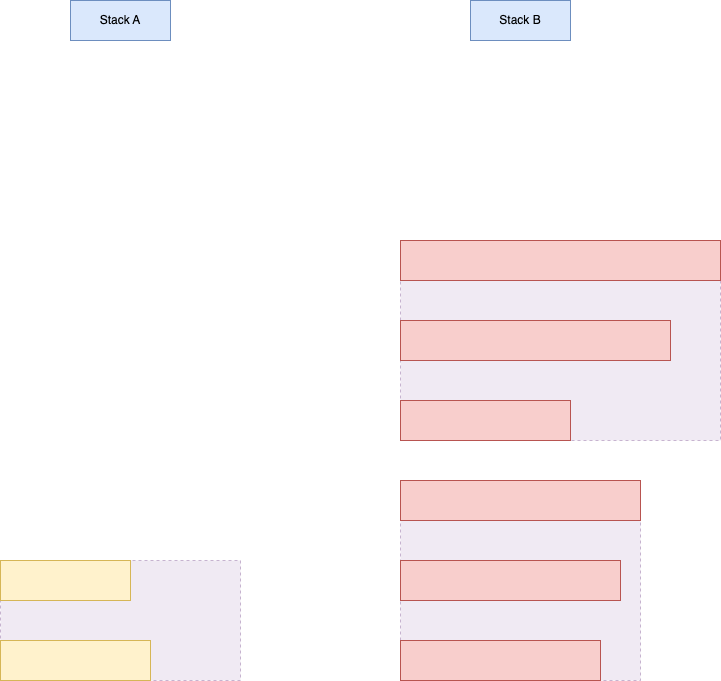
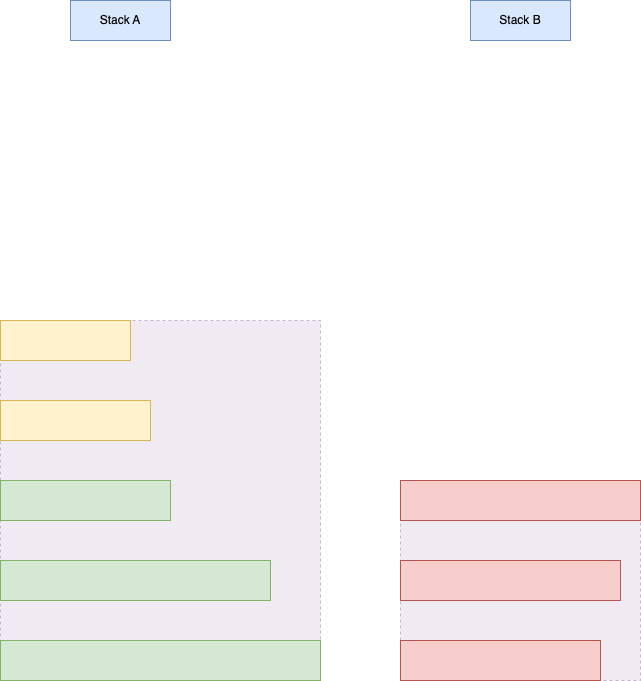
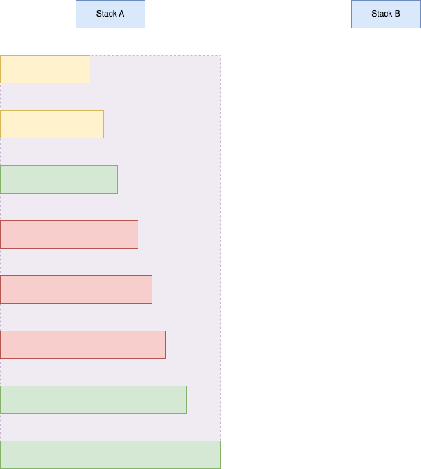
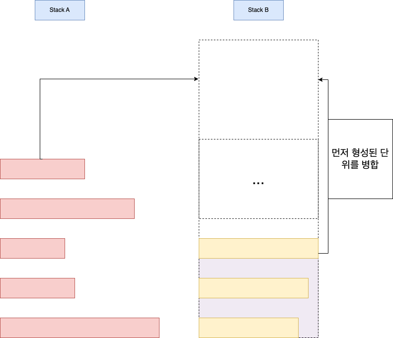

+++
title = '병합 정렬을 사용하여 push_swap 문제 해결하기'
date = 2024-02-21T02:23:56Z
tags = ["C_language", "data structure", "algorithm", "42seoul", "push_swap"]
+++

---
## 병합 정렬을 사용하여 push_swap 문제 해결하기
---

### 개요
  
[스택을 만들었으니]() 이제 정렬을 구현할 차례이다. 42_서울에는 그동안 push_swap 과제를 해결한 수많은 사람들이 축척한 다양한 문제 해결법들이 존재한다. 필자 외 다른 사람들의 해결법을 보고 싶다면 42 서울의 정보 아카이빙 동아리 [팔만코딩경](https://80000coding.oopy.io/aboutus)을 참고하거나, 구글링으로 필자처럼 개인 블로그에 정리한 카뎃들의 글을 참고하는 것을 추천한다.  
  
push_swap 과제에서 정렬하는 것 만큼이나 중요한 것은 ***가능한 적은 연산***(sa, sb, ra 등등)을 사용하여 효울적으로 정렬을 수행하는 것이다. 100개의 인자가 들어왔을 때 연산 700번 이내, 이내, 500개의 인자가 들어왔을 때 5000번 이내로 정렬을 수행해야 만점을 받을 수 있다.  
  
필자는 병합 정렬의 매커니즘을 사용하여 과제를 해결하였다.  
  
---
## 문제해결
---
  
  
  
위와 같은 상황을 가정해보자. stack a에 데이터의 초기값, 그러니까 무작위로 뒤섞인 정수들이 차곡차곡 쌓인 상황이다. 정렬이 시작되기 전이어서 stack b는 비어있다. 우리는 앞서 언급한 연산자들을 적절히 활용하여, 데이터를 스택의 꼭대기나 바닥으로 보내기도 하고, stack a와 b를 왔다갔다 하기도 하면서 stack의 top으로 갈수록 값이 작아지도록 정렬해야한다. 그리고 그 정렬은 최종적으로 b 가 아닌 a에서 이루어져야 한다.  
  
편의상 stack의 맨 위의 노드를 top, top 바로 아래 노드를 mid,  stack의 맨 바닥의 노드를 bot이라 부르기로 한다. 연산 횟수를 줄이려면, 노드를 stack a에서 b로, 또는 b에서 a로 옮길 때 연산의 횟수가 적을수록 좋다. 이미지의 설명과 같이, top, mid, bot 노드는 2회 이내의 연산으로 스택 간 이동이 가능하다. 따라서 스택 간 이동은 top, mid, bod 노드에 한하여 수행하고, 나머지는 배제하기로 한다.  
  
병합 정렬의 기본은 데이터의 집합을 당장 정렬이 가능한 작은 단위로 나눈 후 그 단위에 한하여 정렬하고, 단위들을 병합하는 것이다. 이를 push_swap에 적용한 방식은 다음과 같다.  
  
1. a의 top, mid, bot 중 가장 작은 값을 b로 보낸다.
2. top, mid, bot 중 b로 보낸 값보다 큰 값이 있다면 보낸다. 만약 그러한 값이 여러 개라면 b의 값과 절대값 차이가 가장 적은 값을 보낸다.
3. 조건을 만족하는 한 2.를 반복한다.
4. 2.를 더 이상 수행할 수 없을 때(a의 top, mid, bot 모두 b의 top보다 작을 때) 다시 1.을 수행한다.
5. stack a가 텅 빌 때까지 1~4를 반복한다.
  
위 과정을 수행하면 stack b에 아래와 같은 모양으로 값이 정렬된다.  
  
. 
  
정렬된 최소 단위가 형성된 모습을 볼 수 있다. 정렬을 거꾸로 한 이유는 나중에 다시 a로 옮길 때 위아래가 뒤집어지기 때문이다.  
이 최소 단위들을 아래와 같은 과정으로 병합한다.  

1. 단위들의 1 / 3 개를 스택 a로 옮긴다. 1 / 2이 아닌 1 / 3 만큼 옮기는 이유는 한 번에 3개의 단위를 병합하는 것이 연산 개수 최적화에 유리하기 때문이다.  

  
2. a의 bot과 b의 top 중 더 큰 값을 a의 top으로 옮긴다. 두 최소단위가 완전히 병합될 때까지 이를 반복한다. b가 텅 빌때까지 반복한다.
  
(첫 번째 병합 후)

  
(두 번째 병합 후)

  
위 예시에선 데이터의 개수가 적어 stack a, b를 한 번 왕복한 것만으로 정렬이 완료되었지만 데이터의 개수가 많을 때는 스택 간 왕복을 여러 번 수행해야 한다. a -> b 방향으로 병합을 수행할 때는 a의 top과 b의 bot 중 더 큰 값을 b의 top으로 옮기는 방법으로 병합시키면 된다.

---
## 아직 부족하다. 연산 개수 최적화하기
---
  
위의 방식을 적용하면 정렬 자체는 정상적으로 수행되지만 만점을 받기에는 부족하다. 연산을 더 줄이려면 어떻게 해야할까? 이 알고리즘에서 수행되는 연산은 아래와 같이 분류할 수 있다.

1. 다른 스택으로 최소 정렬 단위들의 일부를 옮기는 연산.
2. stack a, b의 단위들을 병합하는 연산.

최소 정렬 단위를 옮길 때 적은 수의 단위를 옮기면 1.의 연산은 줄어든다. 하지만 2.의 연산은 증가한다. 그 역도 성립하므로 1.과 2.는 trade-off 관계에 있다. 위의 예시에서 단위 개수의 1 / 3을 옮긴 것은 여러 개의 개수를 테스트한 결과 최적의 비율을 찾은 것이다. 하지만 여전히 만점을 받기에는 연산의 개수가 너무 많다. 그래서 추가적인 최적화를 진행해야 했다.  
  
유일하게 1.의 연산을 생략할 수 있는 순간이 있다. 바로 처음 stack a에 데이터가 들어오고 stack b에 최초의 최소 정렬단계를 만드는 순간이다. 최초의 최소 정렬단계를 만드는 순간을 아래와 같이 수정한다.

1. a의 top, mid, bot 중 가장 작은 값을 b로 보낸다.
2. top, mid, bot 중 b로 보낸 값보다 큰 값이 있다면 보낸다. 만약 그러한 값이 여러 개라면 b의 값과 절대값 차이가 가장 적은 값을 보낸다.
3. 조건을 만족하는 한 2.를 반복한다.
4. 최초의 최소 정렬 단위가 형성된다.
5. a의 top, mid, bot, 그리고 b의 bot 중 가장 작은 값을 b의 top으로 보낸다.
6. a의 top, mid, bot, 그리고 b의 bot 중 b의 top으로 보낸 값보다 큰 값이 있다면 보낸다. 만약 그러한 값이 여러 개라면 b top의 값과 절대값 차이가 가장 적은 값을 보낸다.
7. stack a가 텅 빌 때까지 4~6을 반복한다.

위 방식을 사용하면 스택간 데이터의 이동 없이도 단위들을 1회 병합할 수 있게 된다. 따라서 전체적인 연산의 횟수가 줄어들게 된다.

그러나 처음부터 최초 단위를 병합에 활용하면 최초 단위에서만 병합이 이루어진다. 그러면 최초 단위의 크기만 지속적으로 커지기 때문에 rrb 연산이 지나치게 많아져 오히려 연산이 늘어난다. 이러한 케이스를 방지하기 위해 아래 조건을 충족하는 경우에만 최초 단위를 병합에 활용한다.  
  
*stack a에서 b로 데이터의 1 / 3이 넘어간 상태여야 하며, 그 시점에 stack b에 형성된 단위의 개수가 총 데이터 개수 / 100 을 넘어야 한다.*  
  
이 포스트에서 다룬 내용의 코드 구현이 보고싶다면 필자의 [42 seoul git](https://github.com/Budnarae/42_seoul/tree/main)의 push_swap애서 push_swap.c, push_swap_2.c, ..., push_swap_6.c를 참조하기를 바란다.